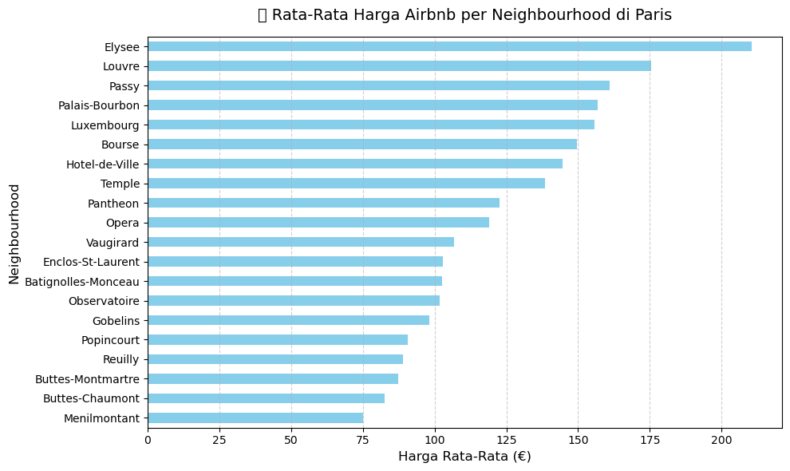
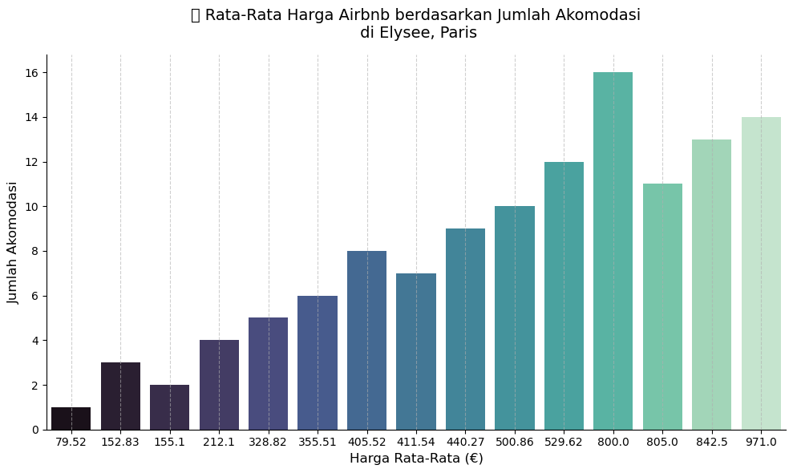
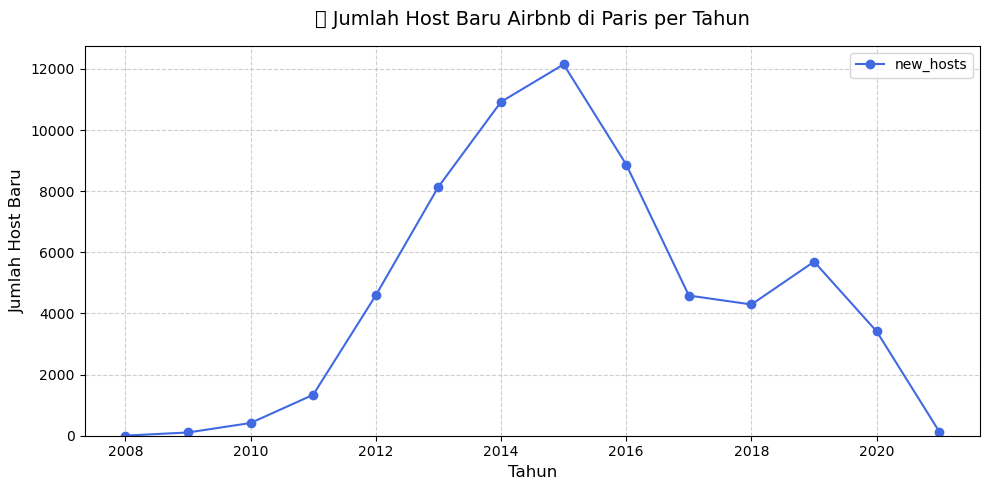
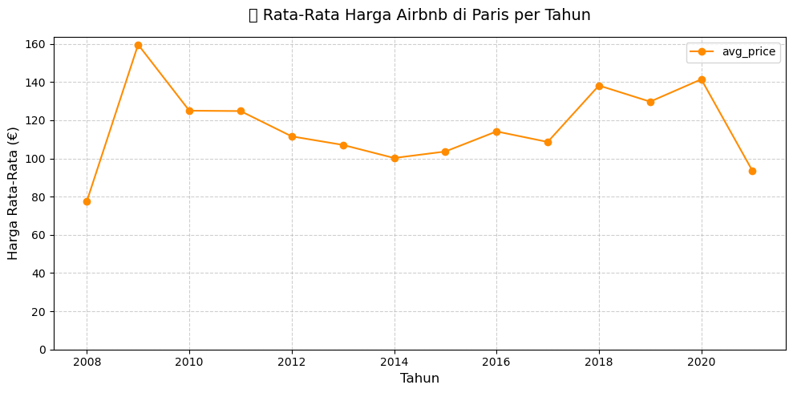

# 🏙️ Airbnb Listing Analysis – Paris

Analisis ini bertujuan untuk memahami dampak regulasi baru terhadap harga dan jumlah host Airbnb di kota Paris.  
Proyek ini merupakan bagian dari pelatihan **Data Analyst Guided Project** di [Maven Analytics](https://app.mavenanalytics.io/guided-projects/4fee7ee7-4c04-46e7-9f3e-99b987980842).

---

## 🎯 Tujuan Proyek

Menganalisis data **Airbnb Listings** untuk:
- Melihat tren jumlah host baru setiap tahun  
- Mengetahui rata-rata harga sewa di tiap *neighbourhood*  
- Membandingkan harga berdasarkan kapasitas akomodasi (*accommodates*)  
- Mengevaluasi dampak regulasi tahun 2015 terhadap pasar Airbnb Paris

---

## 📊 Dataset

**Sumber:** `Listings.csv`  
Dataset berisi informasi listing Airbnb seperti tanggal host bergabung, lokasi, kapasitas, dan harga sewa.

Data difilter hanya untuk kota **Paris**, dengan kolom berikut:
- `host_since`  
- `neighbourhood`  
- `city`  
- `accommodates`  
- `price`

---

## 🧩 Langkah Analisis

### 🧱 Objective 1 — *Profile & QA the Data*
- Mengimpor file `Listings.csv`  
- Mengonversi kolom tanggal (`host_since`) ke format datetime  
- Memfilter hanya data dengan `city = Paris`  
- Mengecek nilai hilang (*missing values*)  
- Menghitung nilai minimum, maksimum, dan rata-rata untuk kolom numerik (`accommodates`, `price`)

---

### 📑 Objective 2 — *Prepare the Data for Visualization*
Membuat *DataFrames* untuk visualisasi:
- **`paris_listings_neighbourhood`**  
  Rata-rata harga per *neighbourhood* (urut dari terendah ke tertinggi)
- **`paris_listings_accommodations`**  
  Rata-rata harga berdasarkan kapasitas akomodasi di *neighbourhood* paling mahal  
- **`paris_listings_over_time`**  
  Jumlah host baru dan rata-rata harga per tahun (`host_since`)

---

### 📈 Objective 3 — *Visualize & Summarize Findings*
Membangun visualisasi dan menemukan insight:
- **Bar Chart Horizontal**
  - Rata-rata harga per *neighbourhood*
  - Rata-rata harga per kapasitas (*accommodates*) di *neighbourhood* termahal  
- **Line Chart**
  - Jumlah host baru per tahun  
  - Rata-rata harga sewa per tahun  
- **Bonus:** Dual Axis Line Chart untuk menampilkan *new hosts* dan *average price* bersama

---

## 📸 Preview Visualisasi

  
  

  
  

---

## 🔍 Insight Utama

- Setelah **regulasi 2015**, terlihat **penurunan jumlah host baru**, menunjukkan dampak kebijakan terhadap pendaftaran host baru.  
- **Harga rata-rata listing meningkat** setelah 2015, menandakan pasar menjadi lebih kompetitif dengan properti yang lebih premium.  
- Beberapa *neighbourhood* populer memiliki harga jauh di atas rata-rata kota, terutama di area pusat dan turistik.  
- Listing dengan kapasitas besar (*accommodates 4+ guests*) menunjukkan peningkatan harga yang signifikan.

---

## 🛠️ Tools & Technologies

- **Python** → Data cleaning & analysis  
- **Pandas** → Manipulasi data  
- **Matplotlib / Seaborn** → Visualisasi  
- **Jupyter Notebook** → Workflow development  

---

## 💡 Kesimpulan

Regulasi tahun 2015 memberikan dampak signifikan terhadap ekosistem Airbnb di Paris.  
Jumlah host baru menurun tajam, namun harga rata-rata listing meningkat.  
Hal ini mengindikasikan pergeseran menuju pasar yang lebih terkendali dan berorientasi pada kualitas.

---

## 📚 Referensi

- [Maven Analytics – Airbnb Listing Analysis Project](https://app.mavenanalytics.io/guided-projects/4fee7ee7-4c04-46e7-9f3e-99b987980842)  
- Dataset publik Airbnb (Kaggle / InsideAirbnb)
